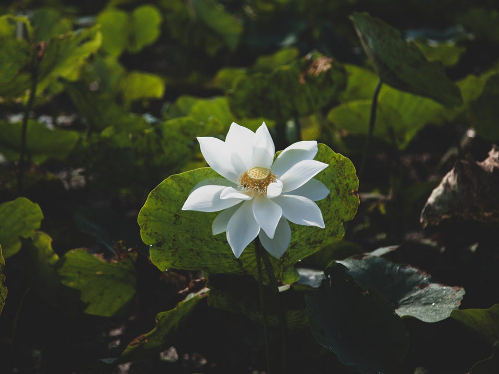

Long I wandered, exiled from my Lord's table.  
Pride-stricken, heart-locked, I stood alone.  
Thought-wise, but not, I sang false truths.  
Eyes raised, star-drunk, I pondered the depths,  
but found only me.  

The soul-deep opened, devouring me whole,  
and I was lost in a cave of twisting shadows,  
a self-made prison for my self-made self.  
I craved reunion but, heart-sealed,  
I fell, again and again, into soul-bleak depths.  

In the darkness of my soul, I found a lotus bud,  
a glimmer of light in the shadows.  
I tilled the darkness into rich earth,  
watered by my soul-stricken tears.  
A one-flower garden, treasured above all else.  

My soul-hungry eyes reached across the abyss,  
looking for anything but myself,  
and found it studded with gleaming jewels.  
I laughed at my folly, seeing the truth
of my soul in the constellation.  

Soul-seared and heart-weary,  
I found peace in the shade,  
sheltered under loving wings.  
Sweet, healing breath restored me,  
whispered from beyond.  

Eyes restored, I cried, "I see you!".  
Heart-drenched, my soul filled  
with the healing waters of life.  
Crowning the waters, rooted in wet muck,  
the white lotus bloomed in light.  

The Lord's chorus sang with joy.  
I was shown the end when love prevails, and  
flowers of every hue fill the garden  
with their soul-sweet scent:  
my white lotus among them.  

Lovingly nudged, I followed the golden thread,  
to my heart-home at the water's mouth.  
There, washed in the sacred waters,  
the light of the world dyed my soul in every hue.  
Home, at last, an exile no more.
